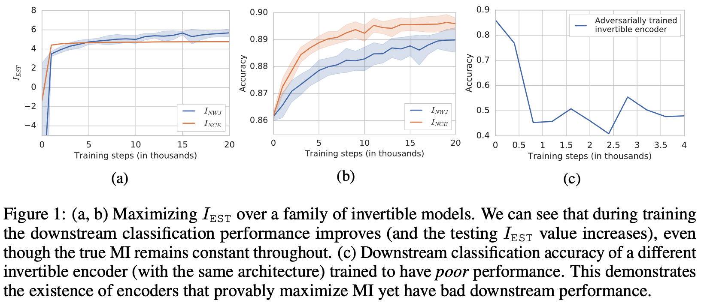

# InfoMax

Paper: [ON MUTUAL INFORMATION MAXIMIZATION FOR REP- RESENTATION LEARNING](https://arxiv.org/abs/1907.13625)  (ICLR2020)

## 01 Mutual Information

- Information gain calculates the reduction in entropy

  - decision tree
  - feature extraction by evaluating the gain of each variable

- entropy

  - quantifies how much information there is in a random variable, or more specifically its probability distribution

  - **Skewed Probability Distribution** (*unsurprising*): Low entropy.

  - **Balanced Probability Distribution** (*surprising*): High entropy

  - Entropy = -(p(0) * log(P(0)) + p(1) * log(P(1)))

- **mutual information**
  - quantifies the "amount of information" obtained about one random variable **through observing the other random variable**
    - measures the information that X & Y share
  - $p(x,y) = p(x)p(y)$ when X & Y independent <==> I(X,Y) = 0

- **Important Property**
  - MI is invariant under reparametrization of the variables
    - if X′ = f1(X) and Y ′ = f2(Y ) are homeomorphisms (i.e. smooth invertible maps), then I (X ; Y ) = I (X ′ ; Y ′ )
  - estimating MI in high-dimensional spaces is notoriously difficult
    - maximize a tractable lower bound
    - 🌟any distribution-free high-confidence lower bound on entropy requires a sample size exponential in the size of the bound

## 02 InfoMax Estimate in Representation Learning

- multi-view formulations

- use this to **estimate the representation of X**
  -  lower-dimensional space
  - modeling flexibility

**Lower bounds on MI**

- Intuition
  - If a classifier can accurately distinguish between samples drawn from the joint p(x, y) and those drawn from the product of marginals p(x)p(y), then X and Y have a high MI.

## 03 This Paper's Thoughts

==approximate MI maximization != representation quality==

- provide empirical evidence to show success of infomax estimates **cannot be attributed to the properties of MI alone**

- maximizing tighter bounds on MI can result in worse representations
- explanation of the success of the recently introduced methods

- maximizing MI does not necessarily lead to useful representations. 
  - large MI is not predictive of downsteam performance
- performance of these estimate above **depends strongly on the bias** that is **encoded in the encoders & actual form of the used estimators.**

### 3.1 Evidence

1.  *bijective* encoder

- Even though the **true MI is maximized** for any choice of model parameters, the **representation quality** (measured by downstream linear classification accuracy) **improves during training**.
- exist **invertible encoders** for which the **representation quality is *worse* than using raw pixels**

- representation quality == accuracy of downstream task using the representation

2. encoders that can model both invertible and non-invertible functions

- encoder can be non-invertible, but is initialized to be invertible, IEST still **biases the encoders to be very ill-conditioned and hard to invert.**

- ?? why ??

3. For INCE and INWJ, higher-capacity critics -> tighter bounds

- Looser bounds with simpler critics can lead to better representations

- VAE also has this problem

  - looser bounds -> better inference models

  

4. optimize the estimators to the same MI lower-bound value with different encoder architectures and show that the representation quality can be impacted more by the choice of the

   architecture, than the estimator.

### 3.2 alternative explanation

**the importance of negative sampling**

when using non- *i.i.d.* samples both the INCE and INWJ values are larger than the true MI, and that when *i.i.d.* samples are used, both are lower bounds on the true MI.

